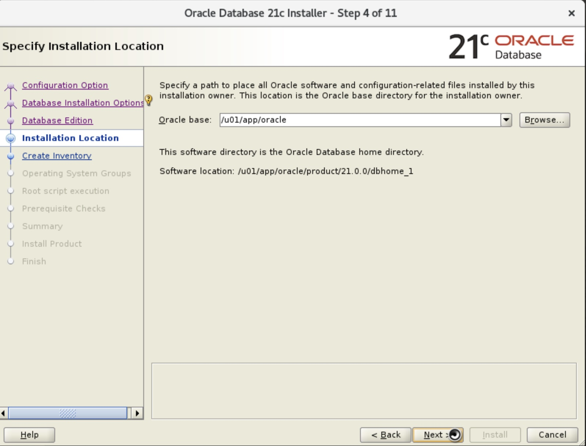
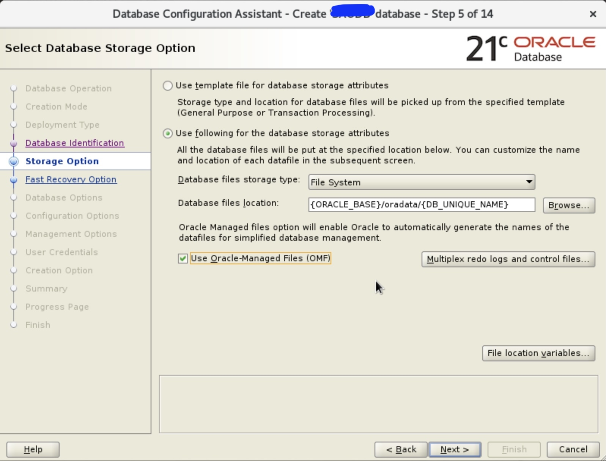
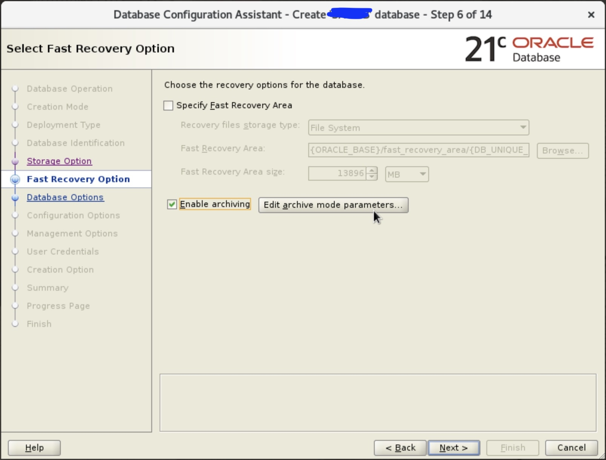
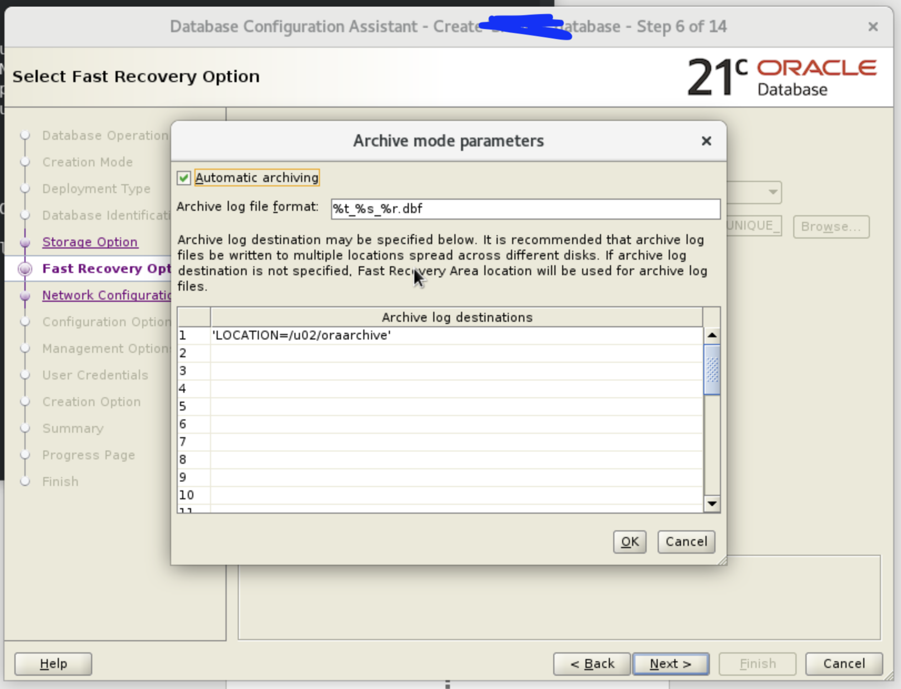
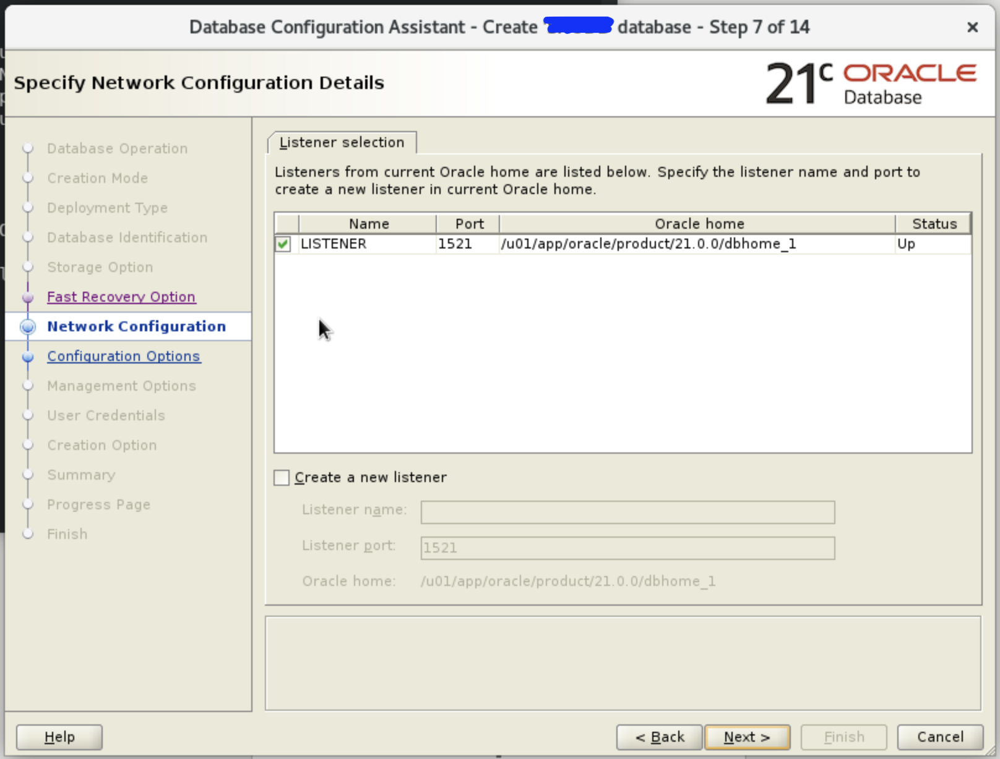
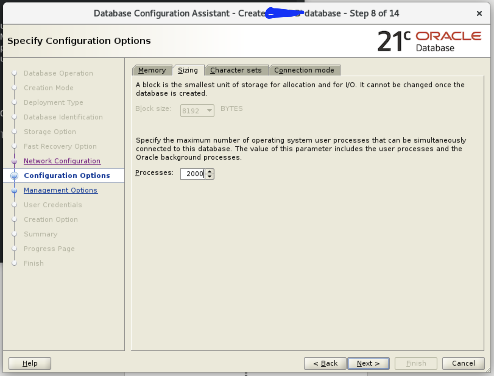

# ติดตั้ง Oracle Database 21c Standard บน Oracle Linux 8

## แก้ไขไฟล์ hosts
```bash
nano /etc/hosts
```

แก้ไขข้อมูลตามด้านล่าง
```bash
[Your IP, 192.168.X.X]  ol8-21.localdomain  ol8-21
```

## ตั้งค่า Hostname
```bash
nano /etc/hostname
```

แก้ไขตั้งค่าตามนี้
```bash
ol8-21.localdomain
```

## Preinstallation

### Automatic installation
```bash
dnf install -y oracle-database-preinstall-21c
dnf update -y
```
หากไม่สามารถติดตั้งได้ลองใช้คำสั่งต่อไปนี้
```bash
curl -o oracle-database-preinstall-21c-1.0-1.el8.x86_64.rpm https://yum.oracle.com/repo/OracleLinux/OL8/appstream/x86_64/getPackage/oracle-database-preinstall-21c-1.0-1.el8.x86_64.rpm
dnf -y localinstall oracle-database-preinstall-21c-1.0-1.el8.x86_64.rpm
```

## ติดตั้ง Package
```bash
dnf install -y bc
dnf install -y binutils
dnf install -y compat-openssl10
dnf install -y elfutils-libelf
dnf install -y glibc
dnf install -y glibc-devel
dnf install -y ksh
dnf install -y libaio
dnf install -y libXrender
dnf install -y libX11
dnf install -y libXau
dnf install -y libXi
dnf install -y libXtst
dnf install -y libgcc
dnf install -y libnsl
dnf install -y libstdc++
dnf install -y libxcb
dnf install -y libibverbs
dnf install -y make
dnf install -y policycoreutils
dnf install -y policycoreutils-python-utils
dnf install -y smartmontools
dnf install -y sysstat
dnf install -y unixODBC
```

## สร้างกลุ่มผู้่ใช้งาน
```bash
groupadd -g 54321 oinstall
groupadd -g 54322 dba
groupadd -g 54323 oper 
groupadd -g 54324 backupdba
groupadd -g 54325 dgdba
groupadd -g 54326 kmdba
groupadd -g 54327 asmdba
groupadd -g 54328 asmoper
groupadd -g 54329 asmadmin
groupadd -g 54330 racdba

useradd -u 54321 -g oinstall -G dba,oper oracle
```

## ตั้งค่าเพิ่มเติม
แก้ไข password ของ oracle
```bash
passwd oracle
```

แก้ไขไฟล์ /etc/selinux/config
```bash
nano /etc/selinux/config
```
เพิ่มคำสั่งต่อไปนี้
```bash
SELINUX=permissive
```
จากนั้นรันคำสั่งต่อไปนี้
```bash
setenforce Permissive
```

## ปิด Firewall
```bash
systemctl stop firewalld
systemctl disable firewalld
```

## สร้าง และตั้งค่า Permission
```bash
mkdir -p /u01/app/oracle/product/21.0.0/dbhome_1
mkdir -p /u02/oradata
mkdir /home/oracle/scripts
chown -R oracle:oinstall /u01 /u02
chmod -R 775 /u01 /u02
chown -R oracle:oinstall /home/oracle/scripts
chmod -R 775 /home/oracle/scripts
```

## สร้าง environment เพื่อตั้งค่า
```bash
cat > /home/oracle/scripts/setEnv.sh <<EOF
# Oracle Settings
export TMP=/tmp
export TMPDIR=\$TMP

export ORACLE_HOSTNAME=ol8-21.localdomain
export ORACLE_UNQNAME=cdb1
export ORACLE_BASE=/u01/app/oracle
export ORACLE_HOME=\$ORACLE_BASE/product/21.0.0/dbhome_1
export ORA_INVENTORY=/u01/app/oraInventory
export ORACLE_SID=cdb1
export PDB_NAME=pdb1
export DATA_DIR=/u02/oradata

export PATH=/usr/sbin:/usr/local/bin:\$PATH
export PATH=\$ORACLE_HOME/bin:\$PATH

export LD_LIBRARY_PATH=\$ORACLE_HOME/lib:/lib:/usr/lib
export CLASSPATH=\$ORACLE_HOME/jlib:\$ORACLE_HOME/rdbms/jlib
EOF
```

```bash
echo ". /home/oracle/scripts/setEnv.sh" >> /home/oracle/.bashrc
echo ". /home/oracle/scripts/setEnv.sh" >> /root/.bashrc
. /home/oracle/scripts/setEnv.sh
```

## สร้างไฟล์ Start/Stop Service
```bash
cat > /home/oracle/scripts/start_all.sh <<EOF
#!/bin/bash
. /home/oracle/scripts/setEnv.sh

export ORAENV_ASK=NO
. oraenv
export ORAENV_ASK=YES

dbstart \$ORACLE_HOME
EOF


cat > /home/oracle/scripts/stop_all.sh <<EOF
#!/bin/bash
. /home/oracle/scripts/setEnv.sh

export ORAENV_ASK=NO
. oraenv
export ORAENV_ASK=YES

dbshut \$ORACLE_HOME
EOF

chown -R oracle:oinstall /home/oracle/scripts
chmod u+x /home/oracle/scripts/*.sh
```

## ติดตั้ง
Logon X
```bash
DISPLAY=[Your IP 192.168.x.x]:0.0; export DISPLAY
```
Login เข้า User `oracle` และดาวน์โหลกไฟล์ [Oracle Database 21c](https://www.oracle.com/th/database/technologies/oracle-database-software-downloads.html#db_ee)
```bash
# Unzip software.
cd $ORACLE_HOME
unzip -oq /path/to/software/LINUX.X64_213000_db_home.zip
```
เปิด Oracle Linux ใน mode GUI จากนั้นรันคำสั่ง
```bash
./runInstaller
```

จากนั้นระบบจะแสดงหน้าต่างระบบดังต่อไปนี้

1. เลือกข้อ `Set Up  Software Only`


2. เลือกหัวข้อ `Single instance database installation`


3. เลือกหัวข้อ `Standard Edition 2`


4. กรอก Oracle base: `/u01/app/oracle`



5. กรอก `/u01/app/oraInventory`


6. เลือก User `oracle`


7. เลือก `Automatically run configuration scripts` จากนั้นเลือก `Use "root" user credential` จากนั้นกรอก Password ของ root


8. เลือก `Fix & Check Again` จากนั้นเลือก `OK`


9. รอการติดตั้ง


10. ติดตั้งเสร็จสิ้น


จากนั้นออกจาก User oracle ไปยัง User root จากนั้นไฟล์ต่อไปนี้
```bash
As a root user, execute the following script(s):
        1. /u01/app/oraInventory/orainstRoot.sh
        2. /u01/app/oracle/product/21.0.0/dbhome_1/root.sh
```

### สร้าง Listner
- พิมพ์คำสั่ง `netca` ใน terminal เมื่อแสดงหน้าต่างตั้งขึ้นมาให้เลือก Listener Configuration จากน้นกด Next


- เลือก Add และกด Next


- กรอกชื่อ Listener


- เลือก Next


- เลือก Use another port number จากนั้นกรอกเลข port ที่ต้องการ


- เลือก No


- เลือก Next


- เลือก Finish


### สร้าง Dabase
```bash
# Start the listener.
lsnrctl start

# Interactive mode.
dbca
```

- เลือก Create a Database


- เลือก Advanced Configuration


- เลือก Database Type เป็น Oracle Single Instance database และ Select a template for your database ให้เลือก General Purpose or Transaction Processing


- กรอก Global Database Name และช่อง SID เป็นชื่อที่ต้องการเช่น cdb และในช่อง PDBname เป็นชื่อ Database เป็นลำดับ เช่น cdbpdb1


- เลือก Use following for the database storage attributes และติ๊กเลือก Use Oracle-Managed Files (OMF)


- เลือก Enable archiving และกดปุ่ม Edit archive mode parameters


- ตั้งค่าตามรูปแล้วกด OK


- กด Next


- เลือก Tab Sizing ในช่อง Processes กรอกเลขตามเงื่อนไขที่ต้องการ คือ ตัวกำหนดจำนวน process สูงสุด ที่ Oracle อนุญาต (รวมทั้ง user sessions และ background processes)
-- 50–200 → สำหรับ test/dev เล็ก ๆ
-- 500–1000 → สำหรับ production ขนาดกลาง
-- 2000+ → สำหรับ production ขนาดใหญ่ ที่มี concurrent users เยอะ


- เลือก Configure Enterprise Manager (EM) database express และช่อง EM database express port ระบุ 5500
- เลือก Use the same administrative password for all accounts ช่อง Password, Confirm Password, Oracle home user password ระบุ
- เลือก Create Database | Click ปุ่ม Customize Storage Locations
- 

## หลังจากติดตั้ง
แก้ไขไฟล์
```bash
nano /etc/oratab
```
แล้วตั้งค่าต่อไปนี้
```bash
cdb1:/u01/app/oracle/product/21.0.0/dbhome_1:Y
```

```bash
sqlplus / as sysdba <<EOF
alter system set db_create_file_dest='${DATA_DIR}';
alter pluggable database ${PDB_NAME} save state;
exit;
EOF
```
